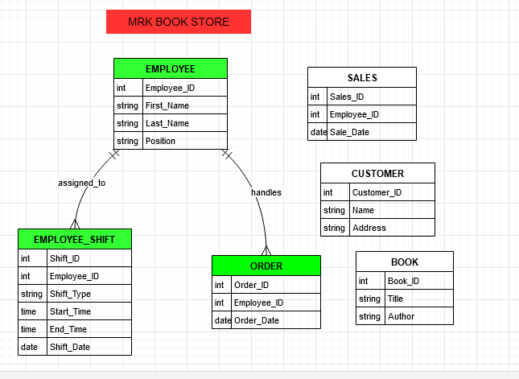

# Assignment 1: Design a Logical Model

## Question 1
Create a logical model for a small bookstore. 📚

At the minimum it should have employee, order, sales, customer, and book entities (tables). Determine sensible column and table design based on what you know about these concepts. Keep it simple, but work out sensible relationships to keep tables reasonably sized. Include a date table. There are several tools online you can use, I'd recommend [_Draw.io_](https://www.drawio.com/) or [_LucidChart_](https://www.lucidchart.com/pages/).

PIC : 


## Question 2
We want to create employee shifts, splitting up the day into morning and evening. Add this to the ERD.

PIC  : 

## Question 3
The store wants to keep customer addresses. Propose two architectures for the CUSTOMER_ADDRESS table, one that will retain changes, and another that will overwrite. Which is type 1, which is type 2?

_Hint, search type 1 vs type 2 slowly changing dimensions._

Bonus: Are there privacy implications to this, why or why not?
```
CUSTOMER_ADDRESS (Type 1 )
-----------------------------
Customer_ID (PK, FK)   
Address_Line1   
Address_Line2   
City   
State   
Postal_Code   
Country   

CUSTOMER_ADDRESS (Type 2 )
-----------------------------
Customer_ID (FK)   
Address_ID (PK)   
Address_Line1   
Address_Line2   
City   
State   
Postal_Code   
Country   
Start_Date   
End_Date   
Current_Flag (boolean)

PIC : c:\Users\ibast\OneDrive\Desktop\SQL\Q 3.png

c:\Users\ibast\OneDrive\Desktop\SQL\Q 3.png

```

## Question 4
Review the AdventureWorks Schema [here](https://imgur.com/a/u0m8fX6)

Highlight at least two differences between it and your ERD. Would you change anything in yours?
```
omplexity and Normalization:

AdventureWorks: The AdventureWorks schema is more complex and deeply normalized. It splits tables into highly specialized components such as Address, SalesOrderHeader, SalesOrderDetail, and others, providing granularity and avoiding redundancy. For example, the address data is stored in an Address table, separate from customer information.
My ERD: My design is simpler, combining all customer-related information, such as addresses, directly within the CUSTOMER_ADDRESS table. While this is functional for smaller applications, it lacks the modularity and reusability present in AdventureWorks.
Potential Change: I would consider splitting my CUSTOMER_ADDRESS table into a dedicated Address table, as seen in AdventureWorks, to support normalization and flexibility for handling shared or reused addresses.

Use of Surrogate Keys:

AdventureWorks: AdventureWorks schema frequently uses surrogate keys (e.g., SalesOrderID, CustomerID), ensuring that each table has a unique, system-generated identifier rather than relying on natural keys like email addresses or names.
My ERD: While I have used primary keys like customer_id, I have not fully embraced the use of surrogate keys for some tables, particularly for composite entities like EMPLOYEE_SHIFT.
Potential Change: I would consider incorporating surrogate keys more consistently across my ERD, especially for composite entities or tables that could evolve, such as CUSTOMER_ADDRESS and EMPLOYEE_SHIFT.
```

PIC : 

# Criteria

[Assignment Rubric](./assignment_rubric.md)

# Submission Information

🚨 **Please review our [Assignment Submission Guide](https://github.com/UofT-DSI/onboarding/blob/main/onboarding_documents/submissions.md)** 🚨 for detailed instructions on how to format, branch, and submit your work. Following these guidelines is crucial for your submissions to be evaluated correctly.

### Submission Parameters:
* Submission Due Date: `September 28, 2024`
* The branch name for your repo should be: `model-design`
* What to submit for this assignment:
    * This markdown (design_a_logical_model.md) should be populated.
    * Two Entity-Relationship Diagrams (preferably in a pdf, jpeg, png format).
* What the pull request link should look like for this assignment: `https://github.com/<your_github_username>/sql/pull/<pr_id>`
    * Open a private window in your browser. Copy and paste the link to your pull request into the address bar. Make sure you can see your pull request properly. This helps the technical facilitator and learning support staff review your submission easily.

Checklist:
- [ ] Create a branch called `model-design`.
- [ ] Ensure that the repository is public.
- [ ] Review [the PR description guidelines](https://github.com/UofT-DSI/onboarding/blob/main/onboarding_documents/submissions.md#guidelines-for-pull-request-descriptions) and adhere to them.
- [ ] Verify that the link is accessible in a private browser window.

If you encounter any difficulties or have questions, please don't hesitate to reach out to our team via our Slack at `#cohort-4-help`. Our Technical Facilitators and Learning Support staff are here to help you navigate any challenges.
